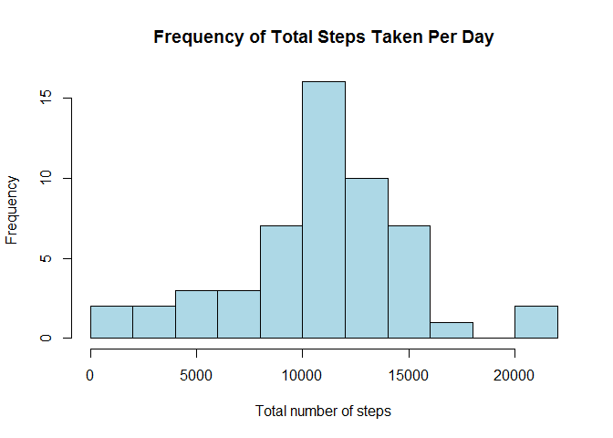
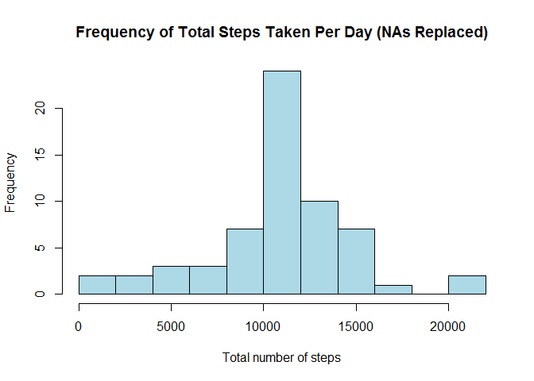
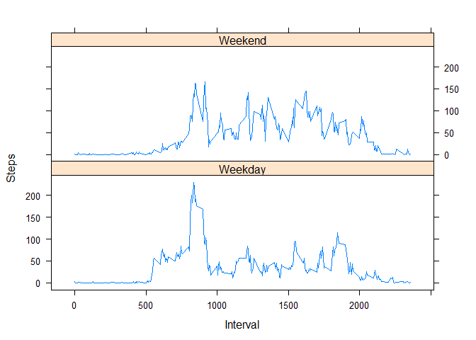

# Reproducible Research: Peer Assessment 1


## Loading and preprocessing the data

The data is stored in a zip file in the repository. The following code will unzip the file and read in the resulting csv. 


```r
unzip("activity.zip")

data <- read.csv("activity.csv")
```

## What is mean total number of steps taken per day?

The following code calculates the total number of steps taken per day, and plots a histogram of this data. 


```r
total_per_day <- tapply(data$steps, data$date, sum)

hist(total_per_day, breaks = 15, main = "Frequency of Total Steps Taken Per Day", xlab = "Total number of steps", col = "lightblue")
```

 

```r
mean(total_per_day, na.rm = TRUE)
```

```
## [1] 10766.19
```

```r
median(total_per_day, na.rm = TRUE)
```

```
## [1] 10765
```
 

## What is the average daily activity pattern?

The following code plots a time series graph of interval against average number of steps taken, and calculates the interval which contains the maximum number of steps. 


```r
average_per_interval <- aggregate(list(data$steps), by = list(data$interval), FUN = mean, na.rm = TRUE)

colnames(average_per_interval) <- c("Interval", "Average Steps")

plot(average_per_interval, type="l")
```

 

```r
average_per_interval.max = average_per_interval[average_per_interval[2] == max(average_per_interval[2]), 1]
```

The interval with the max number of steps, as calculated above, is 835.

## Imputing missing values

The  total number of missing values in the data set is calculated and reported below. 


```r
colSums(is.na(data))[1]
```

```
## steps 
##  2304
```

To fill in the missing values, the following code replaces any NA with the average steps for that particular interval, rounded to the nearest step. Using the newly created data set with no missing values, a histogram is then plotted. 


```r
library(plyr)

na_replaced <- ddply(data, .(interval), transform, steps = ifelse(is.na(steps), round(mean(steps, na.rm=TRUE)), steps), digits = 0)

new_total_per_day <- tapply(na_replaced$steps, na_replaced$date, sum)

hist(new_total_per_day, breaks = 15, main = "Frequency of Total Steps Taken Per Day (NAs Replaced)", xlab = "Total number of steps", col = "lightblue")
```

 

```r
mean(new_total_per_day)
```

```
## [1] 10765.64
```

```r
median(new_total_per_day)
```

```
## [1] 10762
```

You can see from the calculations above that the missing values slightly raise the mean and median of the data set. 

## Are there differences in activity patterns between weekdays and weekends?

The code below checks whether each date is a weekday or weekend, and the time series plot is divided into tow panels, one for each type of day. 


```r
na_replaced$day <- ifelse(weekdays(as.Date(na_replaced$date)) == "Sunday", "Weekend", ifelse(weekdays(as.Date(na_replaced$date)) == "Saturday", "Weekend", "Weekday"))

average_by_interval_and_day <- aggregate(steps ~ interval + day, data = na_replaced, mean)

library(lattice)

xyplot(average_by_interval_and_day$steps ~ average_by_interval_and_day$interval | average_by_interval_and_day$day, average_by_interval_and_day, layout = c(1, 2), type = "l", xlab = "Interval", ylab = "Steps")
```

 
